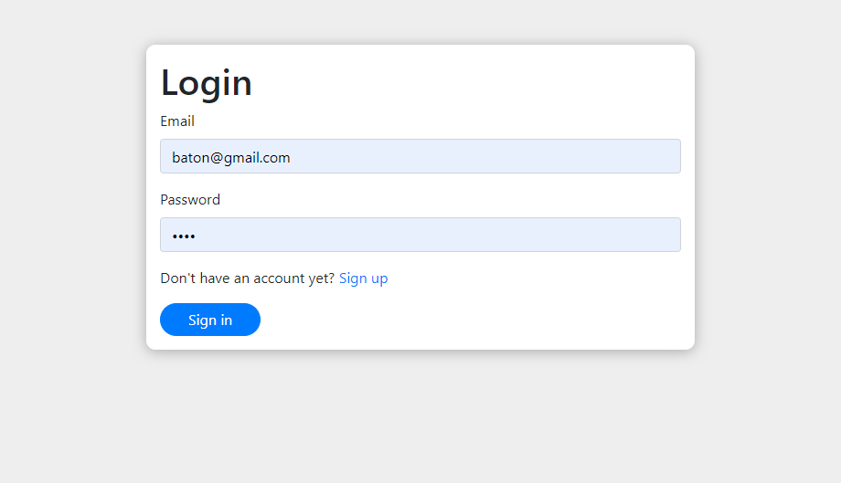
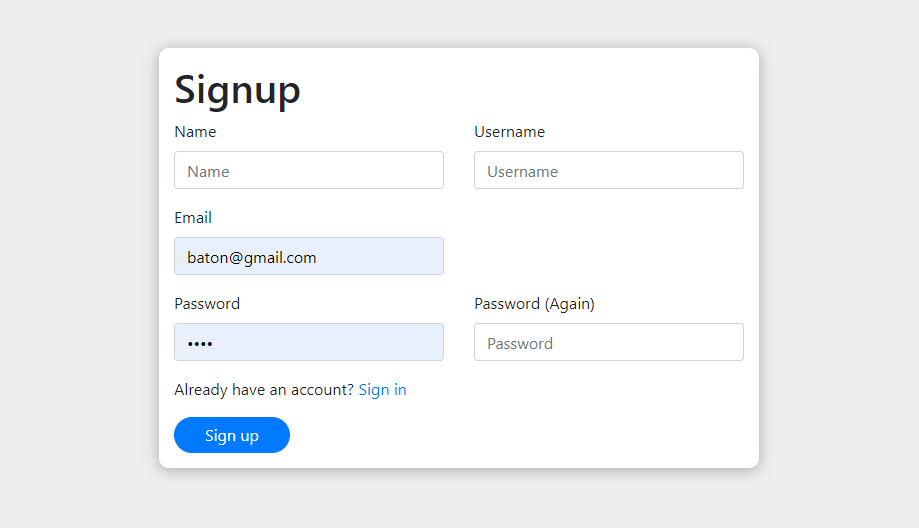
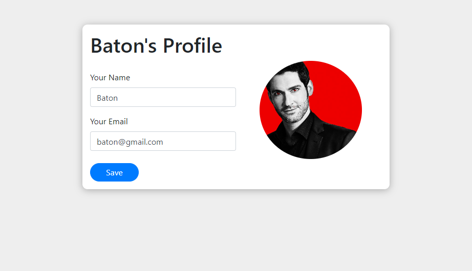
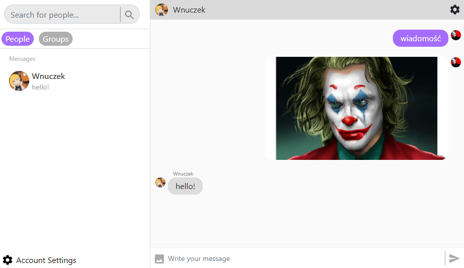
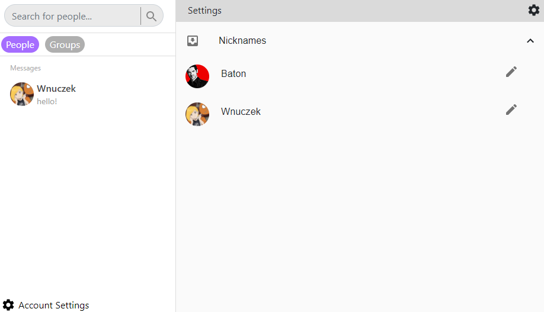
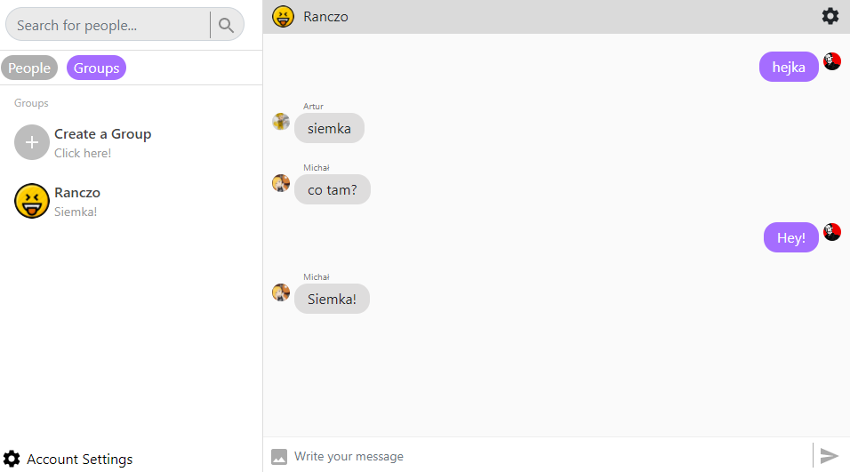
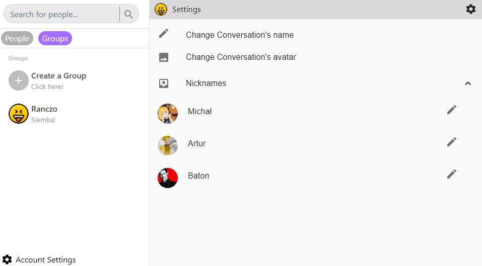

# ReactMess

This project was created for learning purposes. The final version of the application uses the following technologies/tools:
- React
- Redux
- Loopback.js
- Websocket
- Mongodb

##  **Features**
I will present main feutures of this application below.
### *Authentication*
An account is required to use this application. When you first launch ReactMess, you are prompted to enter your credentials to log in or register.

### *Account Management*
Each logged in user has the ability to change their basic credentials and set their own unique avatar   *Note: all images sent through ReactMess are compressed to the appriopriate size* 

### *1-1 Conversations*
The most basic functionality is to have a normal conversation with another person. To start a new thread, search for the user you are looking for by typing their name into the search bar. If he/she is online - app will give you permission to start a new conversation with him/her.

Additionally, in a 1-1 conversation, both parties have the ability to change their nicknames in that specific thread. So there is no problem to have a different show name in each thread.

### *Group Conversations*
In this web application, users can start a group conversation. In the 'Group' section located under the search bar, all available groups are displayed + there is an option to create a new group.

Additionally, in a group conversation, each party has the ability to change thread's avatar,thread's name and usernames.

## Graphic Attribution

Graphic of the bird from the Title Screen was made by 'GraphicMama-team' from [Pixabay](https://pixabay.com/pl/illustrations/ptak-ma%C5%82o-ma%C5%82ych-%C5%82adny-ch%C5%82opiec-1771435/)